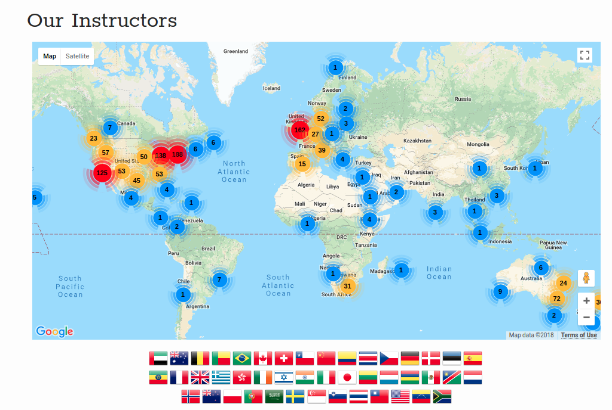
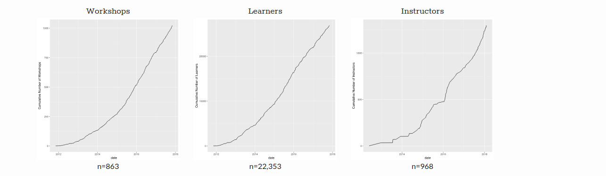
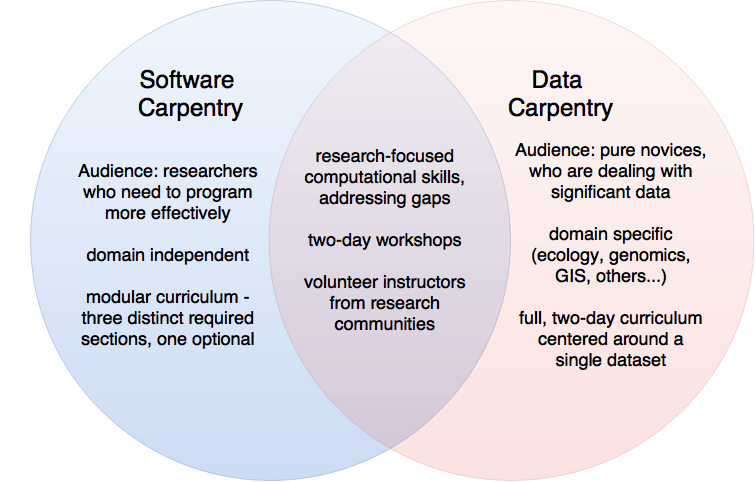
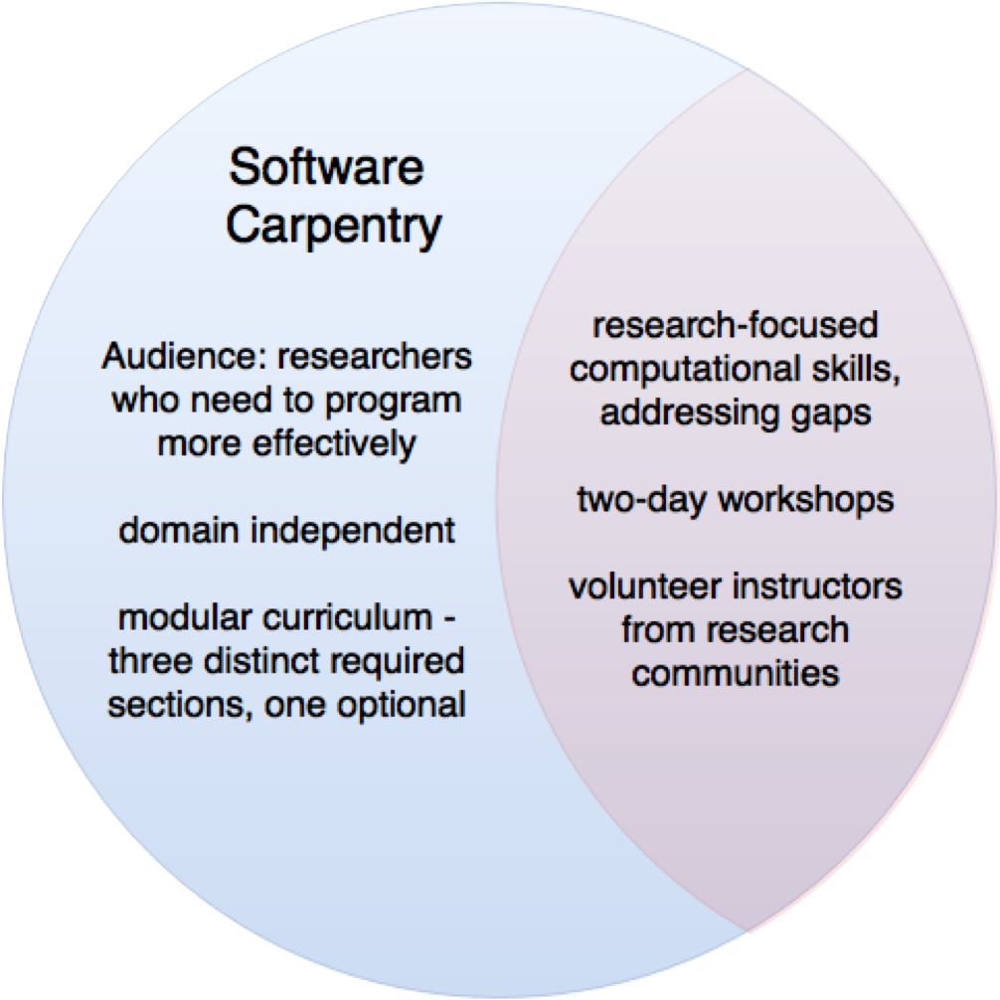
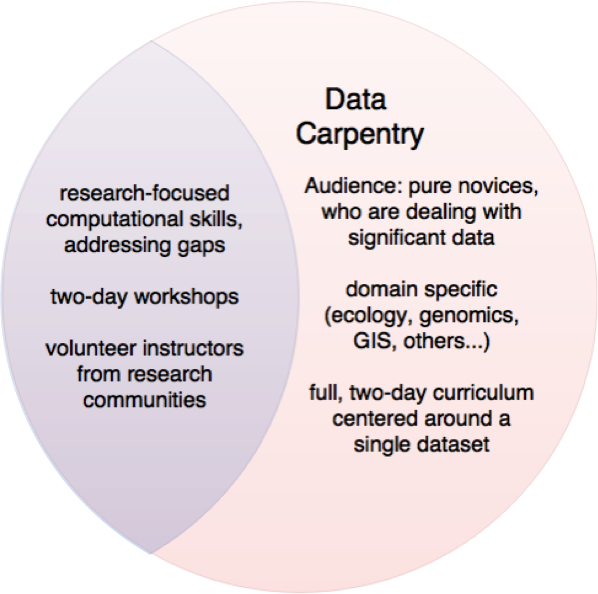
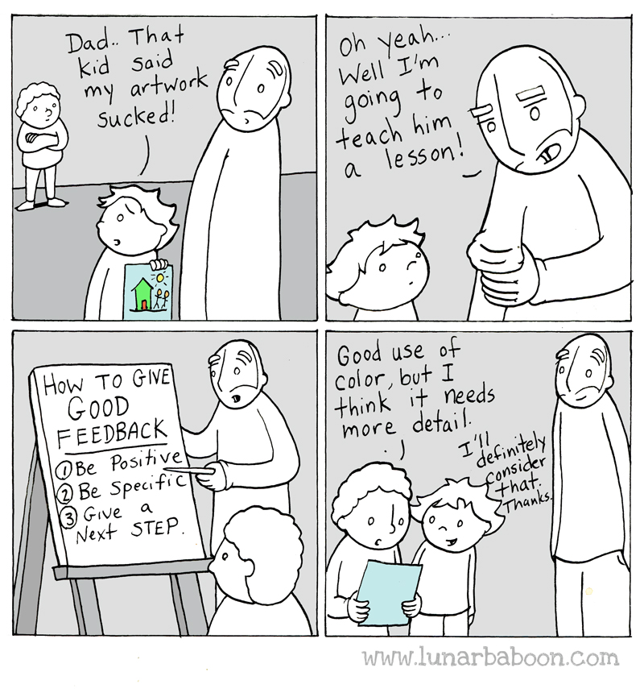
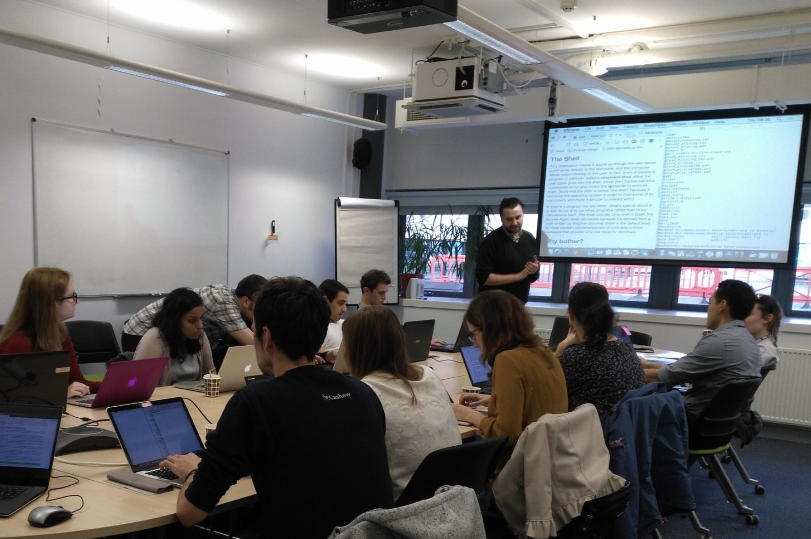
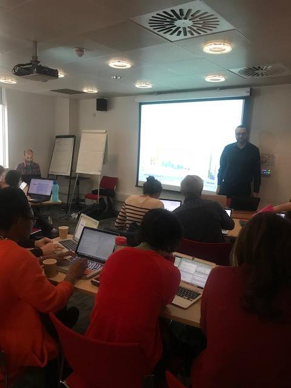

```{r setup, include=FALSE}
knitr::opts_chunk$set(echo = FALSE)
```

  
## The Carpentries
 
```{r , echo=FALSE, , fig.align='center', out.width = '65%'}
 
```


The Carpentries project comprises diverse global community of volunteer Instructors, Trainers, Maintainers, helpers, and supporters who share a mission to teach foundational computational and data science skills to researchers

The main goal of  the carpenteries is not to teach specific skills, per se - although those are covered - but rather, to convey best practices that will enable researchers to be more productive and do better research.
 

 
## What is a Carpentries Workshop?
 
```{r , echo=FALSE, fig.align='center', out.width = '100%'}
 knitr::include_graphics("./fig/TheCarpentries.svg")
```

The Carpentries workshops generally comprise two full days of face-to-face instruction, based on either Software Carpentry or Data Carpentry lesson materials, respectively.
 
- Workshops are taught by volunteer certified  instructors who have completed The Carpentries instructor training course (at least one instructor is certified).
- Software Carpentry and Data Carpentry lessons are all open source, and are hosted on GitHub
 http://www.datacarpentry.org/lessons/#genomics-workshop
 
 

## Impact


```{r , echo=FALSE, fig.align='center', out.width = '100%'}
 
```

- 77% of our respondents reported being more confident in the tools that were covered during their Carpentry workshop compared to before the workshop.
- 54% of our respondents have made their analyses more reproducible as a result of completing a Carpentry workshop.
- 65% of our respondents have gained confidence in working with data as a result of completing the workshop.
- 74% of our respondents have recommended our workshops to a friend or colleague.


 
## Software Carpentry vs Data Carpentry
 
```{r , echo=FALSE, fig.align='center', out.width = '60%'}
 
```
 
 
Both DC and SWC focus:
 
- on computational skills .
- run two-day workshops taught by volunteer instructors .
- strive to fill gaps in current training for researchers.
 
However, they differ in their content and intended audience.
 


## Software Carpentry are:

```{r , echo=FALSE, fig.align='center', out.width = '40%'}
 
```


 
- intended for people who need to program more effectively to solve their computational challenges,
- not domain-specific, and
- modular, each Software Carpentry lesson is standalone.
https://software-carpentry.org/lessons/
 
 
## Data Carpentry:


```{r , echo=FALSE, fig.align='center', out.width = '40%'}
 
```


 
- are aimed at pure novices,
- are domain-specific, and
- present a full curriculum centered around a single data set.
- focus on best practices surrounding data.
 http://www.datacarpentry.org/lessons/
 
 
## Discussion 

Base on your experience, why would you like to learn programming?


## Teaching and hosting workshop

Workshops operates according to The Carpentries Handbook:
https://docs.carpentries.org/topic_folders/workshop_administration/index.html

- as short tutorials alternate with practical exercises
- all instruction is done via live coding
- each workshop’s instructors create a one-page website with information about their workshop and link to teaching content
- instructors are supporterd by helpers with  basic knowledge of the tools we teach and enthusiasm to help others learn.  

## Feedback

```{r , echo=FALSE, fig.align='center', out.width = '40%'}
 
```
 
- In Carpentries teaching, we use the 2x2 paradigm for feedback.
- Each person giving feedback is expected to provide at least one piece of negative and one piece of positive feedback each for content and delivery. 


## Running Software Carpentry workshop, my experience 

```{r , echo=FALSE, fig.align='center', out.width = '40%'}
 
```


https://kpoterlowicz.github.io/2017-10-12-oxford-swc/

 
 
## Running Data Carpentry workshop, my experience 

```{r , echo=FALSE, fig.align='center', out.width = '40%'}
 
```


https://kpoterlowicz.github.io/2018-05-03-KCL/
 
## Discussion
 
Would the Carpentries workshop be useful for your area of experise ? Why ?  
  