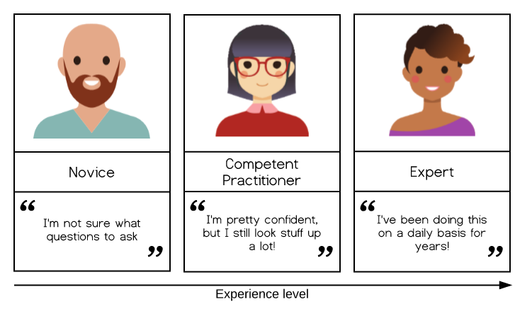

```{r setup, include=FALSE}
knitr::opts_chunk$set(echo = FALSE)
```

## The Carpentries

The Carpentries project comprises diverse global community of volunteer Instructors, Trainers, Maintainers, helpers, and supporters who share a mission to teach foundational computational and data science skills to researchers

The main goal of  the carpenteries is not to teach specific skills, per se - although those are covered - but rather, to convey best practices that will enable researchers to be more productive and do better research.


## What is a Carpentries Workshop?

The Carpentries workshops generally comprise two full days of face-to-face instruction, based on either Software Carpentry or Data Carpentry lesson materials, respectively.

- Workshops are taught by volunteer certified  instructors who have completed The Carpentries instructor training course. 
- Software Carpentry and Data Carpentry lessons are all open source, and are hosted on GitHub.  

## The Carpentries Pedagogical Model

The Carpentries aim to teach computational competence to learners. We take an applied approach, avoiding the theoretical and general in favor of the practical and specific. By showing learners how to solve specific problems with specific tools and providing hands-on practice, we develop learners’ confidence and lay the foundation for future learning.

A critical component of this process is that learners are able to practice what they are learning in real time, get feedback on what they are doing, and then apply those lessons learned to the next step in the learning process. Having learners help each other during the workshops also helps to reinforce concepts taught during the workshops.

A Carpentries workshop is an interactive event – for learners and instructors. We give and receive feedback throughout the course of a workshop. We incorporate assessments within the lesson materials and ask for feedback on sticky notes during lunch breaks and at the end of each day. In this way, instructors can adjust the pace and content of a workshop to meet the needs of the learners in that group, as well as collect feedback that will help us improve lesson materials or methodology for future workshops. Instructors and helpers also provide feedback to learners throughout workshops in order to get them unstuck or provide a greater depth of understanding about the materials. Interacting in this way with the learners helps us determine how they are doing and figure out what concepts people are having trouble with or where we might be able to move along more quickly.


## The Acquisition of Skill
Our approach is based on the work of researchers like Patricia Benner, who applied the Dreyfus model of skill acquisition in her studies of how nurses progress from novice to expert (see also books by Benner). This work indicates that through practice and formal instruction, learners acquire skills and advance through distinct stages. In simplified form, the three stages of this model are:

```{r , echo=FALSE, fig.cap="A caption", out.width = '70%'}

```


## Cognitive Development and Mental Models
Effective learning is facilitated by the creation of a mental model. A mental model is a collection of concepts and facts, along with the relationships between those concepts, which a person has about a topic. For example, a long-time resident of the United States may have an advanced understanding of the location of US states, major cities and landmarks, weather patterns, regional economies and demographic patterns, as well as the relationships among these, compared with their understanding of these relationships for other countries. In other words, their mental model of the United States is more complex compared with their mental model of other countries.

We can distinguish between a novice and a competent practitioner for a given domain based on the complexity of their mental models.

A novice is someone who has not yet built a mental model of the domain. They therefore reason by analogy and guesswork, borrowing bits and pieces of their mental models of other domains which seem superficially similar.
A competent practitioner is someone who has a mental model that’s good enough for everyday purposes. This model does not have to be completely accurate in order to be useful: for example, the average driver’s mental model of how a car works probably doesn’t include most of the complexities that a mechanical engineer would be concerned with.
We will discuss the mental models of experts in more detail in a later lesson.

(add excercise)


## Identifying and Correcting Misconceptions
How do we expose misconceptions, especially as they pertain to broken models? How can we, in-class, know whether the learners already understand this topic (so that the class can move on), and if not, what misconceptions and gaps in their knowledge we should address.

To be effective, instructors need feedback on their learners’ progress, and insight into their learners’ mental models. This feedback comes through formative assessments.

Formative assessments provide feedback to both instructors and learners about learners’ level of understanding of the material. For learners, this feedback can help focus their study efforts. For instructors, it allows them to refocus their instruction to respond to challenges that learners are facing.

Formative assessment is most useful when it happens frequently (we’ll talk about how frequently later) and when the results are easily interpretable by the learner and instructor.

Instructors should use a formative assessment ideally every 5 minutes and at least every 10-15 minutes in order to make sure that the class is actually learning. Since the average attention span is usually only this long, formative assessments also help break up instructional time and re-focus attention.  Formative assessments can also be used preemptively: if you start a class with a question and everyone can answer it correctly, then you can safely skip the part of the lecture in which you were going to explain something that your learners already know.


## Software Carpentry vs Data Carpentry

Both DC and SWC focus: 

- on computational skills.
- run two-day workshops taught by volunteer instructors.
- strive to fill gaps in current training for researchers.

However, they differ in their content and intended audience.

## Data Carpentry workshops:

- are aimed at pure novices,
- are domain-specific, and
- present a full curriculum centered around a single data set.
- focus on best practices surrounding data.


## Software Carpentry workshops are:

- intended for people who need to program more effectively to solve their computational challenges,
- not domain-specific, and
- modular—each Software Carpentry lesson is standalone.
 

 

## Slide with Bullets

- Bullet 1
- Bullet 2
- Bullet 3

## Slide with R Output

```{r cars, echo = TRUE}
summary(cars)
```

## Slide with Plot

```{r pressure}
plot(pressure)
```

